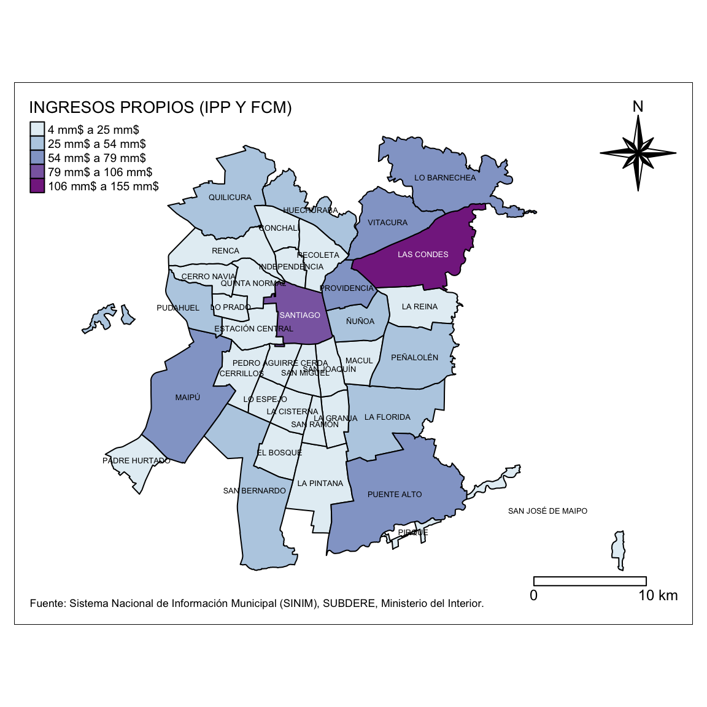
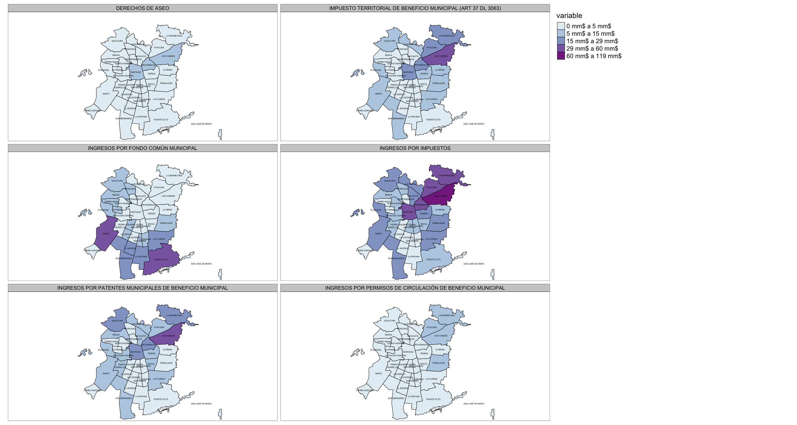
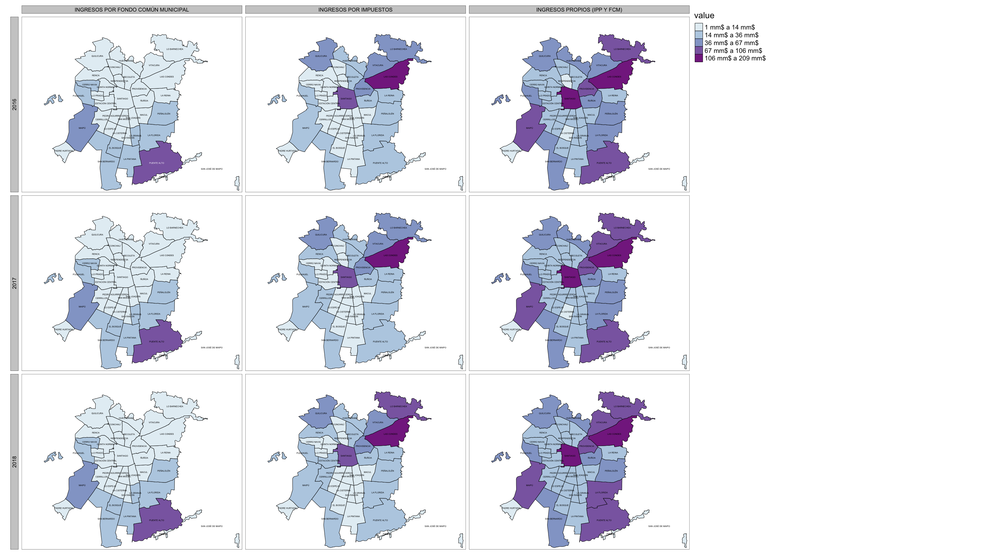
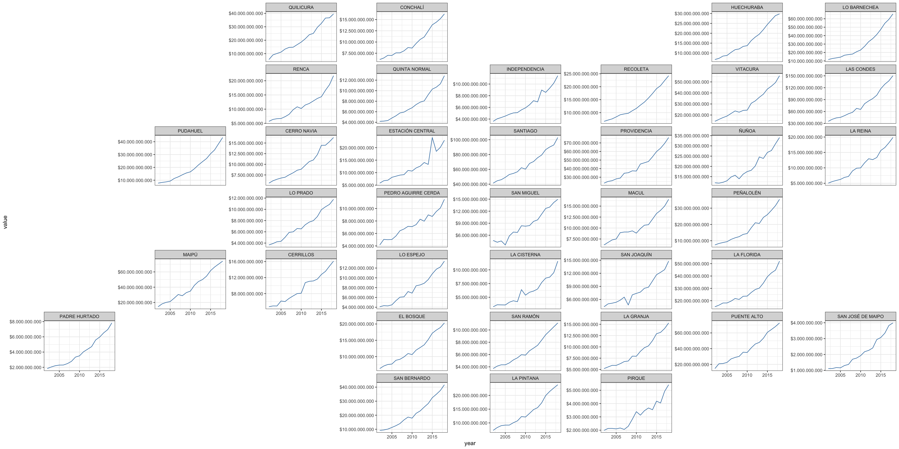

[](https://saythanks.io/to/robsalasco)
[](https://www.paypal.com/cgi-bin/webscr?cmd=_donations&business=WDDLRUVD344XL&currency_code=USD&source=url)

[](https://ci.appveyor.com/project/robsalasco/sinimr)
[](https://codecov.io/github/robsalasco/sinimr?branch=master)

# sinimR 

Chilean Municipalities Information System Wrapper

### What can I do with this?

This R package allows easy SINIM (<http://sinim.gov.cl>) data retrieval
what have advantages over the site:

  - When you work with multiple variables or years it will be very
    useful for rapid analyses.
  - Fast ploting directly from data source using the included
    geometries.
  - Data download with or without monetary correction using a switch.

<!-- end list -->

``` r
library(dplyr)
library(sinimr)
library(sf)
library(tmap)

varcode <- 882
var <- get_sinim(varcode, 2018, 
                 region = 13, 
                 truevalue = T, 
                 geometry = T, 
                 auc = T, 
                 unit = "limites")

gran_santiago_plot <- tm_shape(var) +
  tm_fill(col = "value",
          palette = "BuPu", 
          border.col = "white", 
          border.alpha = 0.5,
          lwd=1,
          style = "jenks",
          title = get_sinim_var_name(varcode))+
  tm_text("municipality", size = 0.4, style="jenks") +
  tm_legend(legend.position = c("left", "top"), legend.title.size = 1, legend.text.size = 0.6) +
  tm_compass(type = "8star", position = c(.85, .80)) +
  tm_scale_bar(breaks = c(0, 10), text.size = 0.75, position = c("right", "bottom")) +
  tm_credits("Fuente: Sistema Nacional de Información Municipal (SINIM), SUBDERE, Ministerio del Interior.", position=c("left", "bottom"), size=0.55)+
  tm_layout(legend.width=1,
            inner.margins = c(0.1, 0.1, 0.10, 0.1), 
            legend.format = list(text.separator = "a", 
                                 fun = mm)) +
  tm_borders(col = 'black')


gran_santiago_plot
```



### Support

FONDECYT Regular 2016 Nº 1161417, ¿Quién es responsable del desarrollo
local? Una geografía política del neoestructuralismo en “comunas de
exportación” (Comisión Nacional de Investigación Científica y
Tecnológica).

### A note on usage

When querying the API, please be respectful of the resources required to
provide this data. Please retain the results for each request to avoid
repeated requests for duplicate information.

### Installation

``` r
install.packages("devtools")
devtools::install_github("robsalasco/sinimr")
```

### How do I use it?

sinimR comes with a small set of functions to deliver the content of
SINIM’s webpage. To get a first glance of the categories of information
what are available please use the `get_sinim_cats()` command.

``` r
library(sinimr)
get_sinim_cats()
#> $`-`
#>     variable code
#> 1 * SIM FIMU  539
#> 
#> $`01.  ADMINISTRACION Y FINANZAS MUNICIPALES`
#>                                             variable code
#> 1  A.1. PRESUPUESTO INICIAL Y VIGENTE MUNICIPAL (M$)  517
#> 2                       A. INGRESOS MUNICIPALES (M$)   21
#> 3                        B. INGRESOS MUNICIPALES (%)  191
#> 4                         C. GASTOS MUNICIPALES (M$)   22
#> 5                          D. GASTOS MUNICIPALES (%)  172
#> 6                              E. GASTOS EN PERSONAL  169
#> 7                      F. TRANSFERENCIAS E INVERSION  170
#> 8                   G. SERVICIOS BASICOS Y GENERALES  370
#> 9         I. TRANSFERENCIAS Y COMPENSACIONES SUBDERE  485
#> 10                    J. FONDO COMÚN MUNICIPAL (FCM)  508
#> 11                              K. GESTION MUNICIPAL  486
#> 12                                               L.    24
#> 13                                                M.  506
#> 
#> $`02.  RECURSOS HUMANOS MUNICIPAL`
#>                 variable code
#> 1  A. PERSONAL DE PLANTA  381
#> 2 B. PERSONAL A CONTRATA  382
#> 3         C. HONORARIOS   383
#> 4   D. OTROS INDICADORES  384
#> 
#> $`03.  EDUCACION MUNICIPAL`
#>                                     variable code
#> 1     A. ANTECEDENTES GENERALES DE EDUCACION   38
#> 2    B. ASISTENCIA Y MATRÍCULAS EN EDUCACION   32
#> 3                          C. RESULTADOS PSU   33
#> 4         D. INGRESOS EN EDUCACION MUNICIPAL   35
#> 5           E. GASTOS EN EDUCACION MUNICIPAL   36
#> 6    F. RECURSOS HUMANOS EN SECTOR EDUCACION   34
#> 7 G. ESTABLECIMIENTOS DE EDUCACION MUNICIPAL  379
#> 
#> $`04.  SALUD MUNICIPAL`
#>                             variable code
#> 1 A. ANTECEDENTES GENERALES DE SALUD   30
#> 2    B. COBERTURA EN SALUD MUNICIPAL   25
#> 3    C. INGRESOS  EN SALUD MUNICIPAL   26
#> 4       D. GASTOS EN SALUD MUNICIPAL   28
#> 5           E. RED ASISTENCIAL SALUD   31
#> 6       F. RECURSOS HUMANOS EN SALUD  362
#> 
#> $`05.  SOCIAL Y COMUNITARIA`
#>                                variable code
#> 1         A. INFORMACION ENCUESTA CASEN   47
#> 2 B. RED SOCIAL (SUBSIDIOS Y PENSIONES)   44
#> 3             C. INTERMEDIACION LABORAL   43
#> 4        D. ORGANIZACIONES COMUNITARIAS   46
#> 5                              E. BECAS  377
#> 6            F. PARTICIPACIÓN CIUDADANA  510
#> 7                       G. DISCAPACIDAD  512
#> 8              H. PREVENCIÓN DEL DELITO  511
#> 
#> $`06.  DESARROLLO Y GESTION TERRITORIAL`
#>                                     variable code
#> 1           A. CARACTERISTICAS TERRITORIALES   39
#> 2        B. SERVICIOS BASICOS A LA COMUNIDAD   41
#> 3                         C. INFRAESTRUCTURA   40
#> 4 D. CATASTRO PREDIOS Y VALORACION CATASTRAL  300
#> 5                           E. AREAS VERDES   376
#> 6    F. PLAN DE DESARROLLO COMUNAL (PLADECO)  304
#> 7                  G. PLAN REGULADOR COMUNAL   42
#> 
#> $`07.  CARACTERIZACION COMUNAL`
#>                       variable code
#> 1 A. GEOGRAFICO ADMINISTRATIVA   49
#> 2                 B. POBLACION   50
#> 
#> $`08.  GENERO`
#>                                           variable code
#> 1 A. DOTACION FUNCIONARIA Y PROFESIONAL DE MUJERES  262
#> 
#> $`09. CEMENTERIO`
#>                      variable code
#> 1      1. INFORMACION GENERAL  516
#> 2 A. INGRESOS CEMENTERIO (M$)  456
#> 3   B. GASTOS CEMENTERIO (M$)  457
```

Every category have a bunch of variables associated. Use the CODE number
and the `get_sinim_vars()` function to get them.

``` r
get_sinim_vars(517)
#>                                                       variable unit code
#> 108                       Presupuesto Inicial Sector Municipal M$   4210
#> 109                     Presupuesto Inicial Gastos Municipales M$   4211
#> 110                       Presupuesto Vigente Sector Municipal M$   4212
#> 111                     Presupuesto Vigente Gastos Municpiales M$   4213
#> 112 Presupuesto Vigente Saldo Inicial de Caja Sector Municipal M$   4226
#> 113 Presupuesto Inicial Saldo Inicial de Caja sector Municipal M$   4441
```

Finally, to obtain the data across municipalities use the code column
and specify a year.

``` r
head(get_sinim(c(4210, 4211), 2015))
#>   code  municipality year                               variable    value
#> 1 1101       IQUIQUE 2015 PRESUPUESTO INICIAL GASTOS MUNICIPALES 35295076
#> 2 1107 ALTO HOSPICIO 2015 PRESUPUESTO INICIAL GASTOS MUNICIPALES 10263084
#> 3 1401  POZO ALMONTE 2015 PRESUPUESTO INICIAL GASTOS MUNICIPALES  7685704
#> 4 1402        CAMIÑA 2015 PRESUPUESTO INICIAL GASTOS MUNICIPALES  1319970
#> 5 1403      COLCHANE 2015 PRESUPUESTO INICIAL GASTOS MUNICIPALES  2130495
#> 6 1404         HUARA 2015 PRESUPUESTO INICIAL GASTOS MUNICIPALES  3267375
```

By default the values are in **miles de millones** but it can be
disabled using the `truevalue = T` switch.

``` r
head(get_sinim(c(4210, 4211), 2015, truevalue = T))
#>   code  municipality year                               variable       value
#> 1 1101       IQUIQUE 2015 PRESUPUESTO INICIAL GASTOS MUNICIPALES 35295076000
#> 2 1107 ALTO HOSPICIO 2015 PRESUPUESTO INICIAL GASTOS MUNICIPALES 10263084000
#> 3 1401  POZO ALMONTE 2015 PRESUPUESTO INICIAL GASTOS MUNICIPALES  7685704000
#> 4 1402        CAMIÑA 2015 PRESUPUESTO INICIAL GASTOS MUNICIPALES  1319970000
#> 5 1403      COLCHANE 2015 PRESUPUESTO INICIAL GASTOS MUNICIPALES  2130495000
#> 6 1404         HUARA 2015 PRESUPUESTO INICIAL GASTOS MUNICIPALES  3267375000
```

You can get multiple years too\! use the command `get_sinim()` and add
more years as in the example.

``` r
head(get_sinim(880, 2015:2017))
#>   code  municipality year                           variable   value
#> 1 1101       IQUIQUE 2017 INGRESOS POR FONDO COMÚN MUNICIPAL 3439830
#> 2 1107 ALTO HOSPICIO 2017 INGRESOS POR FONDO COMÚN MUNICIPAL 7258188
#> 3 1401  POZO ALMONTE 2017 INGRESOS POR FONDO COMÚN MUNICIPAL 1888333
#> 4 1402        CAMIÑA 2017 INGRESOS POR FONDO COMÚN MUNICIPAL 1626482
#> 5 1403      COLCHANE 2017 INGRESOS POR FONDO COMÚN MUNICIPAL 1156020
#> 6 1404         HUARA 2017 INGRESOS POR FONDO COMÚN MUNICIPAL 1406921
```

The geometries are available in long format using the `geometry=T`
argument. By default it uses the **comunal** geographies but the
**limite urbano censal** is also available. The switches are
`unit="comunas"` and `unit="limites"`. Note: Using **limites** not all
features are available because some comunas are not related to urban
zones. As shown in the example below you can obtain multiple years and
variables in long format.

``` r
head(get_sinim(882, 2015:2017, geometry=T))
#> Simple feature collection with 6 features and 5 fields
#> geometry type:  MULTIPOLYGON
#> dimension:      XY
#> bbox:           xmin: -70.20924 ymin: -21.43871 xmax: -69.81985 ymax: -20.04854
#> geographic CRS: WGS 84
#>   code  municipality year                     variable    value
#> 1 1101       IQUIQUE 2016 INGRESOS PROPIOS (IPP Y FCM) 36638105
#> 2 1101       IQUIQUE 2015 INGRESOS PROPIOS (IPP Y FCM) 35186041
#> 3 1101       IQUIQUE 2017 INGRESOS PROPIOS (IPP Y FCM) 37924449
#> 4 1107 ALTO HOSPICIO 2017 INGRESOS PROPIOS (IPP Y FCM) 11377923
#> 5 1107 ALTO HOSPICIO 2016 INGRESOS PROPIOS (IPP Y FCM) 10913779
#> 6 1107 ALTO HOSPICIO 2015 INGRESOS PROPIOS (IPP Y FCM) 10705074
#>                         geometry
#> 1 MULTIPOLYGON (((-70.09894 -...
#> 2 MULTIPOLYGON (((-70.09894 -...
#> 3 MULTIPOLYGON (((-70.09894 -...
#> 4 MULTIPOLYGON (((-70.1095 -2...
#> 5 MULTIPOLYGON (((-70.1095 -2...
#> 6 MULTIPOLYGON (((-70.1095 -2...
```

Another interesting feature is the possibility to subset by different
contexts. e.g if you want the comunas of Antofagasta region this command
is available. The command works with or without the presence of the
geometry switch and other switches are avaiblable too `region`,
`provincia` and `comuna` all working with codes.

``` r
head(get_sinim(882, 2015:2017, geometry=T, region=2))
#> Simple feature collection with 6 features and 5 fields
#> geometry type:  MULTIPOLYGON
#> dimension:      XY
#> bbox:           xmin: -70.62886 ymin: -25.40293 xmax: -68.0676 ymax: -22.4254
#> geographic CRS: WGS 84
#>   code municipality year                     variable    value
#> 1 2101  ANTOFAGASTA 2015 INGRESOS PROPIOS (IPP Y FCM) 50480057
#> 2 2101  ANTOFAGASTA 2017 INGRESOS PROPIOS (IPP Y FCM) 53481425
#> 3 2101  ANTOFAGASTA 2016 INGRESOS PROPIOS (IPP Y FCM) 53775528
#> 4 2102   MEJILLONES 2016 INGRESOS PROPIOS (IPP Y FCM)  7031571
#> 5 2102   MEJILLONES 2015 INGRESOS PROPIOS (IPP Y FCM)  6400071
#> 6 2102   MEJILLONES 2017 INGRESOS PROPIOS (IPP Y FCM)       NA
#>                         geometry
#> 1 MULTIPOLYGON (((-70.60654 -...
#> 2 MULTIPOLYGON (((-70.60654 -...
#> 3 MULTIPOLYGON (((-70.60654 -...
#> 4 MULTIPOLYGON (((-69.97002 -...
#> 5 MULTIPOLYGON (((-69.97002 -...
#> 6 MULTIPOLYGON (((-69.97002 -...
```

You can get a subset too

``` r
head(get_sinim(882, 2015:2017, geometry=T, region=c(2,3)))
#> Simple feature collection with 6 features and 5 fields
#> geometry type:  MULTIPOLYGON
#> dimension:      XY
#> bbox:           xmin: -70.62886 ymin: -25.40293 xmax: -68.0676 ymax: -22.4254
#> geographic CRS: WGS 84
#>   code municipality year                     variable    value
#> 1 2101  ANTOFAGASTA 2016 INGRESOS PROPIOS (IPP Y FCM) 53775528
#> 2 2101  ANTOFAGASTA 2015 INGRESOS PROPIOS (IPP Y FCM) 50480057
#> 3 2101  ANTOFAGASTA 2017 INGRESOS PROPIOS (IPP Y FCM) 53481425
#> 4 2102   MEJILLONES 2016 INGRESOS PROPIOS (IPP Y FCM)  7031571
#> 5 2102   MEJILLONES 2015 INGRESOS PROPIOS (IPP Y FCM)  6400071
#> 6 2102   MEJILLONES 2017 INGRESOS PROPIOS (IPP Y FCM)       NA
#>                         geometry
#> 1 MULTIPOLYGON (((-70.60654 -...
#> 2 MULTIPOLYGON (((-70.60654 -...
#> 3 MULTIPOLYGON (((-70.60654 -...
#> 4 MULTIPOLYGON (((-69.97002 -...
#> 5 MULTIPOLYGON (((-69.97002 -...
#> 6 MULTIPOLYGON (((-69.97002 -...
```

But where obtain the codes? a database is provided and you can filter it
using the standard R functions.

``` r
head(id_geo_census)
#>   code  municipality code.reg  nom.reg code.prov  nom.prov auc
#> 1 1101       IQUIQUE        1 TARAPACA        11   IQUIQUE   1
#> 2 1107 ALTO HOSPICIO        1 TARAPACA        11   IQUIQUE   1
#> 3 1401  POZO ALMONTE        1 TARAPACA        14 TAMARUGAL   0
#> 4 1402        CAMIÑA        1 TARAPACA        14 TAMARUGAL   0
#> 5 1403      COLCHANE        1 TARAPACA        14 TAMARUGAL   0
#> 6 1404         HUARA        1 TARAPACA        14 TAMARUGAL   0
```

Related to variables if you don’t know what are you looking for use
`search_sinim_vars()`to get search results based on variable
descriptions, names and groups.

``` r
search_sinim_vars("cementerio")
#>     code
#> 356 4140
#> 357 4141
#> 358 4406
#> 359 4407
#>                                                                                                                                   variable
#> 356                                                                                          Ingresos Cementerio (Ingreso Total Percibido)
#> 357                                                                                              Gastos Cementerio (Gasto Total Devengado)
#> 358                                                                                 ¿La Municipalidad o Corporación administra Cementerio?
#> 359 Si la Municipalidad o Corporación administra Cementerio, indique si tiene presupuesto propio. SI = presupuesto propio o independiente.
#>                                                                                                                                                                  description
#> 356                                                                                              Ingreso total percibido del sector Cementerio (clasificador presupuestario)
#> 357                                                                                                  Gastos total devengado sector Cementerio (clasificador presupuestario).
#> 358 Indica si la Municipalidad o Corporación administra o no Cementerio Municipal, ya sea con presupuesto propio o asociado a otro sector de la municipalidad o corporación.
#> 359                                             Indica si administra un presupuesto independiente o anexo a otro sector de la municipalidad, como Salud, Municipalidad, etc.
#>               area                     subarea unit
#> 356 09. CEMENTERIO A. INGRESOS CEMENTERIO (M$) M$  
#> 357 09. CEMENTERIO   B. GASTOS CEMENTERIO (M$) M$  
#> 358 09. CEMENTERIO      1. INFORMACION GENERAL S-N 
#> 359 09. CEMENTERIO      1. INFORMACION GENERAL S-N
```

## Advanced usage

SINIM (Sistema Nacional de Información Municipal) by default applies a
monetary correction to show current values of variables. The original
values provided by municipalities are available using the `moncorr = F`
switch. And if you want geographical identifiers like region or
provincia you can apply them using `idgeo = T` switch.

### Other example plots

#### Multiple variable faceted plot

``` r
library(tmap)
library(dplyr)
library(stringr)
library(sinimr)
library(sf)

data_sinim <- get_sinim(var = c(3954,4174,880,1226,4251,4173), 
                        year = 2018, 
                        region = 13,
                        geometry = T,
                        truevalue = T,
                        auc = T,
                        unit = "limites")

gran_santiago_plot <- tm_shape(data_sinim) +
  tm_fill(col = "value",
          palette = "BuPu", 
          border.col = "white", 
          border.alpha = 0.5,
          lwd=1,
          style = "jenks",
          title = "variable")+
  tm_text("municipality", size = 0.4) +
  tm_style("white", frame = T, legend.title.size = 1, legend.width=1) +
  tm_layout(inner.margins = c(0.01, 0.1, 0.1, 0.01),
            outer.margins = c(0.01, 0.01, 0.01, 0.01),
            design.mode=F,
            legend.format = list(text.separator = "a",
                                 fun = mm))+
  tm_borders(col = 'black') +
  tm_facets(by="variable", ncol = 2)

gran_santiago_plot
```



#### A variable in multiple years using facets

``` r
library(dplyr)
library(sinimr)
library(sf)
library(tmap)


var <- get_sinim(c(880, 882, 1226),
                 2016:2018, 
                 region = 13,
                 truevalue = T, 
                 geometry = T,
                 auc = T,
                 unit = "limites")

gran_santiago_plot <- tm_shape(var) +
  tm_fill("value",
          palette="BuPu", 
          border.col = "white", 
          style = "jenks", 
          border.alpha = 0.5,
          lwd=1) +
  tm_text("municipality", size = 0.4) +
  tm_legend(legend.position = c("left", "top")) +
  tm_layout(legend.width=0.09,
            inner.margins = c(0.01, 0.1, 0.1, 0.01),
            outer.margins = c(0.01, 0.01, 0.01, 0.01),
            legend.format = list(text.separator = "a",
                                 fun = mm)) +
  tm_facets(by=c("year","variable"),) +
  tm_borders(col = 'black')

gran_santiago_plot
```



#### Multiple variables and years using geofacet

``` r
library(sf)
library(dplyr)
library(geofacet)
library(sinimr)
library(ggplot2)
library(zoo)
library(scales)
library(ggpubr)

data <- get_sinim(882, 2002:2018,
                  region = 13,
                  moncorr = F, 
                  truevalue = T,
                  auc = T)

data$year <- as.numeric(as.character(data$year))
data$year <- as.Date(as.yearmon(data$year, "1-%y"))

reg13 <- geogrid::read_polygons("https://raw.githubusercontent.com/robsalasco/precenso_2016_geojson_chile/master/Extras/GRAN_SANTIAGO.geojson")
#> Warning: 'geogrid::read_polygons' is deprecated.
#> Use 'sf::st_read' instead.
#> See help("Deprecated")
#> Reading layer `R13' from data source `https://raw.githubusercontent.com/robsalasco/precenso_2016_geojson_chile/master/Extras/GRAN_SANTIAGO.geojson' using driver `GeoJSON'
#> Simple feature collection with 37 features and 8 fields
#> geometry type:  POLYGON
#> dimension:      XY
#> bbox:           xmin: -70.84306 ymin: -33.65716 xmax: -70.43015 ymax: -33.31069
#> geographic CRS: WGS 84
grd <- grid_auto(reg13, seed = 1, names = "NOM_COMUNA", codes = "COMUNA")

#grid_preview(grd, label = "name_NOM_COMUNA")
#grid_design(grd, label = "name_NOM_COMUNA")

ggplot(data, aes(year, value, group=1)) +
  geom_line(color = "steelblue") +
  facet_geo(~ municipality, grid = grd, scales = "free_y")+
  scale_x_date() +
  scale_y_continuous(labels = dollar_format(suffix = "", prefix = "$", big.mark = ".", decimal.mark=","))+
  theme_bw()
```



### Citation

``` r
citation("sinimr")
#> 
#> To cite package 'sinimr' in publications use:
#> 
#>   Roberto Salas (2019). sinimr: Chilean Municipalities Information
#>   System Wrapper. R package version 0.3.0.
#>   https://github.com/robsalasco/sinimr
#> 
#> A BibTeX entry for LaTeX users is
#> 
#>   @Manual{,
#>     title = {sinimr: Chilean Municipalities Information System Wrapper},
#>     author = {Roberto Salas},
#>     year = {2019},
#>     note = {R package version 0.3.0},
#>     url = {https://github.com/robsalasco/sinimr},
#>   }
```

### References

  - Sistema Nacional de Información Municipal (SINIM), SUBDERE,
    Ministerio del Interior.
