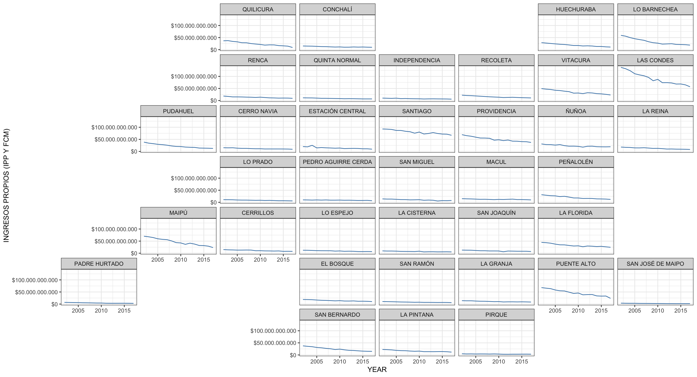
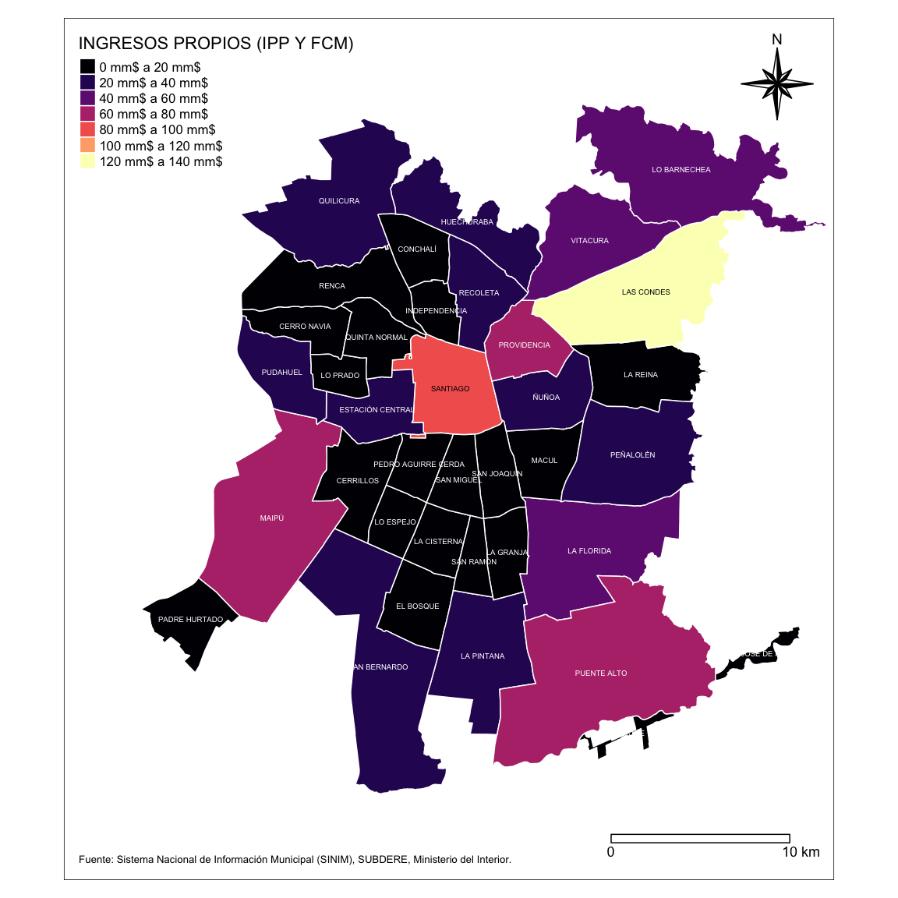

[](https://saythanks.io/to/robsalasco)
[](https://www.paypal.com/cgi-bin/webscr?cmd=_donations&business=WDDLRUVD344XL&currency_code=USD&source=url)
[](https://travis-ci.org/robsalasco/sinimr)
[](https://ci.appveyor.com/project/robsalasco/sinimr)
[](https://codecov.io/github/robsalasco/sinimr?branch=master)

# sinimR 

Chilean Municipalities Information System Wrapper

### Support

FONDECYT Regular 2016 Nº 1161417, ¿Quién es responsable del desarrollo
local? Una geografía política del neoestructuralismo en “comunas de
exportación” (Comisión Nacional de Investigación Científica y
Tecnológica).

### A note on usage

When querying the API, please be respectful of the resources required to
provide this data. Please retain the results for each request to avoid
repeated requests for duplicate information.

### What can I do with this?

This R package allows easy SINIM (<http://sinim.gov.cl>) data retrieval
what have advantages over the site:

  - When you work with multiple variables or years it will be very
    useful for rapid analyses.
  - Fast ploting directly from data source.
  - Data download with or without monetary correction using a switch.



### Installation

``` r
install.packages("devtools")
devtools::install_github("robsalasco/sinimr")
```

### How do I use it?

sinimR comes with a small set of functions to deliver the content of
SINIM’s webpage. To get a first glance of the categories of information
what are available please use the `getsinimcategories()` command.

``` r
library(sinimr)
get_sinim_cats()
#> $`-`
#>     VARIABLE CODE
#> 1 * SIM FIMU  539
#> 
#> $`01.  ADMINISTRACION Y FINANZAS MUNICIPALES`
#>                                             VARIABLE CODE
#> 1  A.1. PRESUPUESTO INICIAL Y VIGENTE MUNICIPAL (M$)  517
#> 2                       A. INGRESOS MUNICIPALES (M$)   21
#> 3                        B. INGRESOS MUNICIPALES (%)  191
#> 4                         C. GASTOS MUNICIPALES (M$)   22
#> 5                          D. GASTOS MUNICIPALES (%)  172
#> 6                              E. GASTOS EN PERSONAL  169
#> 7                      F. TRANSFERENCIAS E INVERSION  170
#> 8                   G. SERVICIOS BASICOS Y GENERALES  370
#> 9         I. TRANSFERENCIAS Y COMPENSACIONES SUBDERE  485
#> 10                    J. FONDO COMÚN MUNICIPAL (FCM)  508
#> 11                              K. GESTION MUNICIPAL  486
#> 12                                               L.    24
#> 13                                                M.  506
#> 
#> $`02.  RECURSOS HUMANOS MUNICIPAL`
#>                 VARIABLE CODE
#> 1  A. PERSONAL DE PLANTA  381
#> 2 B. PERSONAL A CONTRATA  382
#> 3         C. HONORARIOS   383
#> 4  D. CÓDIGO DEL TRABAJO  523
#> 5   D. OTROS INDICADORES  384
#> 
#> $`03.  EDUCACION MUNICIPAL`
#>                                     VARIABLE CODE
#> 1     A. ANTECEDENTES GENERALES DE EDUCACION   38
#> 2    B. ASISTENCIA Y MATRÍCULAS EN EDUCACION   32
#> 3                          C. RESULTADOS PSU   33
#> 4         D. INGRESOS EN EDUCACION MUNICIPAL   35
#> 5           E. GASTOS EN EDUCACION MUNICIPAL   36
#> 6    F. RECURSOS HUMANOS EN SECTOR EDUCACION   34
#> 7 G. ESTABLECIMIENTOS DE EDUCACION MUNICIPAL  379
#> 
#> $`04.  SALUD MUNICIPAL`
#>                             VARIABLE CODE
#> 1 A. ANTECEDENTES GENERALES DE SALUD   30
#> 2    B. COBERTURA EN SALUD MUNICIPAL   25
#> 3    C. INGRESOS  EN SALUD MUNICIPAL   26
#> 4       D. GASTOS EN SALUD MUNICIPAL   28
#> 5           E. RED ASISTENCIAL SALUD   31
#> 6       F. RECURSOS HUMANOS EN SALUD  362
#> 
#> $`05.  SOCIAL Y COMUNITARIA`
#>                                VARIABLE CODE
#> 1         A. INFORMACION ENCUESTA CASEN   47
#> 2 B. RED SOCIAL (SUBSIDIOS Y PENSIONES)   44
#> 3             C. INTERMEDIACION LABORAL   43
#> 4        D. ORGANIZACIONES COMUNITARIAS   46
#> 5                              E. BECAS  377
#> 6            F. PARTICIPACIÓN CIUDADANA  510
#> 7                       G. DISCAPACIDAD  512
#> 8              H. PREVENCIÓN DEL DELITO  511
#> 
#> $`06.  DESARROLLO Y GESTION TERRITORIAL`
#>                                     VARIABLE CODE
#> 1           A. CARACTERISTICAS TERRITORIALES   39
#> 2        B. SERVICIOS BASICOS A LA COMUNIDAD   41
#> 3                         C. INFRAESTRUCTURA   40
#> 4 D. CATASTRO PREDIOS Y VALORACION CATASTRAL  300
#> 5                           E. AREAS VERDES   376
#> 6    F. PLAN DE DESARROLLO COMUNAL (PLADECO)  304
#> 7                  G. PLAN REGULADOR COMUNAL   42
#> 
#> $`07.  CARACTERIZACION COMUNAL`
#>                       VARIABLE CODE
#> 1 A. GEOGRAFICO ADMINISTRATIVA   49
#> 2                 B. POBLACION   50
#> 
#> $`08.  GENERO`
#>                                           VARIABLE CODE
#> 1 A. DOTACION FUNCIONARIA Y PROFESIONAL DE MUJERES  262
#> 
#> $`09. CEMENTERIO`
#>                      VARIABLE CODE
#> 1      1. INFORMACION GENERAL  516
#> 2 A. INGRESOS CEMENTERIO (M$)  456
#> 3   B. GASTOS CEMENTERIO (M$)  457
```

Every category have a bunch of variables associated. Use the CODE number
and the `getsinimvariables()` function to get them.

``` r
get_sinim_vars(517)
#>                                                       VARIABLE UNIT CODE
#> 108                       Presupuesto Inicial Sector Municipal M$   4210
#> 109                     Presupuesto Inicial Gastos Municipales M$   4211
#> 110                       Presupuesto Vigente Sector Municipal M$   4212
#> 111                     Presupuesto Vigente Gastos Municpiales M$   4213
#> 112 Presupuesto Vigente Saldo Inicial de Caja Sector Municipal M$   4226
```

Finally, to obtain the data across municipalities use the code column
and specify a year.

``` r
head(get_sinim(c(4210,4211),2015))
#>    CODE  MUNICIPALITY YEAR                               VARIABLE
#> 1 01101       IQUIQUE 2015 PRESUPUESTO INICIAL GASTOS MUNICIPALES
#> 2 01107 ALTO HOSPICIO 2015 PRESUPUESTO INICIAL GASTOS MUNICIPALES
#> 3 01401  POZO ALMONTE 2015 PRESUPUESTO INICIAL GASTOS MUNICIPALES
#> 4 01402        CAMIÑA 2015 PRESUPUESTO INICIAL GASTOS MUNICIPALES
#> 5 01403      COLCHANE 2015 PRESUPUESTO INICIAL GASTOS MUNICIPALES
#> 6 01404         HUARA 2015 PRESUPUESTO INICIAL GASTOS MUNICIPALES
#>         VALUE
#> 1 34245763000
#> 2  9957966000
#> 3  7457210000
#> 4  1280727000
#> 5  2067156000
#> 6  3170237000
```

You can get multiple years too\! use the command `getsinimr()` and add
more years as in the example.

``` r
head(get_sinim(880,2015:2017))
#>    CODE  MUNICIPALITY YEAR                           VARIABLE      VALUE
#> 1 01101       IQUIQUE 2017 INGRESOS POR FONDO COMÚN MUNICIPAL 3342108000
#> 2 01107 ALTO HOSPICIO 2017 INGRESOS POR FONDO COMÚN MUNICIPAL 7051989000
#> 3 01401  POZO ALMONTE 2017 INGRESOS POR FONDO COMÚN MUNICIPAL 1834687000
#> 4 01402        CAMIÑA 2017 INGRESOS POR FONDO COMÚN MUNICIPAL 1580275000
#> 5 01403      COLCHANE 2017 INGRESOS POR FONDO COMÚN MUNICIPAL 1123179000
#> 6 01404         HUARA 2017 INGRESOS POR FONDO COMÚN MUNICIPAL 1366952000
```

If you don’t know what are you looking for use `searchsinimvar()`to get
search results based on variable descriptions, names and groups.

``` r
search_sinim_vars("cementerio")
#>     CODE
#> 350 4140
#> 351 4141
#> 352 4406
#> 353 4407
#>                                                                                                                                   VARIABLE
#> 350                                                                                          Ingresos Cementerio (Ingreso Total Percibido)
#> 351                                                                                              Gastos Cementerio (Gasto Total Devengado)
#> 352                                                                                 ¿La Municipalidad o Corporación administra Cementerio?
#> 353 Si la Municipalidad o Corporación administra Cementerio, indique si tiene presupuesto propio. SI = presupuesto propio o independiente.
#>                                                                                                                                                                  DESCRIPTION
#> 350                                                                                              Ingreso total percibido del sector Cementerio (clasificador presupuestario)
#> 351                                                                                                  Gastos total devengado sector Cementerio (clasificador presupuestario).
#> 352 Indica si la Municipalidad o Corporación administra o no Cementerio Municipal, ya sea con presupuesto propio o asociado a otro sector de la municipalidad o corporación.
#> 353                                             Indica si administra un presupuesto independiente o anexo a otro sector de la municipalidad, como Salud, Municipalidad, etc.
#>               AREA                     SUBAREA UNIT
#> 350 09. CEMENTERIO A. INGRESOS CEMENTERIO (M$) M$  
#> 351 09. CEMENTERIO   B. GASTOS CEMENTERIO (M$) M$  
#> 352 09. CEMENTERIO      1. INFORMACION GENERAL S-N 
#> 353 09. CEMENTERIO      1. INFORMACION GENERAL S-N
```

### Example plot

``` r
library(dplyr)
library(sinimr)
library(sf)
library(tmap)

reg13 <- read_sf("https://raw.githubusercontent.com/robsalasco/precenso_2016_geojson_chile/master/Extras/GRAN_SANTIAGO.geojson")

comunas <- c("CERRILLOS", "LA REINA", "PUDAHUEL", "CERRO NAVIA", "LAS CONDES",
             "QUILICURA", "CONCHALÍ", "LO BARNECHEA", "QUINTA NORMAL", "EL BOSQUE",
             "LO ESPEJO", "RECOLETA", "ESTACIÓN CENTRAL", "LO PRADO", "RENCA", "HUECHURABA",
             "MACUL", "SAN MIGUEL", "INDEPENDENCIA", "MAIPÚ", "SAN JOAQUÍN", "LA CISTERNA", "ÑUÑOA",
             "SAN RAMÓN", "LA FLORIDA", "PEDRO AGUIRRE CERDA", "SANTIAGO", "LA PINTANA", "PEÑALOLÉN",
             "VITACURA", "LA GRANJA", "PROVIDENCIA", "SAN BERNARDO", "PUENTE ALTO", "PADRE HURTADO", "PIRQUE",
             "SAN JOSÉ DE MAIPO")

var <- get_sinim(882, 2017) %>% filter(MUNICIPALITY %in% comunas)

var[5] <- var[5]*1000

var.reg13.join <- reg13 %>%
  select(COMUNA) %>% 
  transmute(CODE = as.character(COMUNA)) %>%
  right_join(var, by=c("CODE"))

reg.13.plot <- tm_shape(var.reg13.join) +
  tm_polygons(names(var.reg13.join)[5], palette="magma", border.col = "white") +
  tm_text(names(var.reg13.join)[2], size = 0.4, style="jenks") +
  tm_legend(legend.position = c("left", "top")) +
  tm_compass(type = "8star", position = c("right", "top")) +
  tm_scale_bar(breaks = c(0, 10), size = 0.75, position = c("right", "bottom"), width = 1) +
  tm_credits("Fuente: Sistema Nacional de Información Municipal (SINIM), SUBDERE, Ministerio del Interior.", position=c("left", "bottom"), size=0.55)+
  tm_layout(inner.margins = c(0.1, 0.1, 0.10, 0.01), legend.format = list(text.separator = "a", fun = function(x) paste0(formatC(x/1e9, digits = 0, format = "f"), " mm$")))

reg.13.plot
```



### Citation

``` r
citation("sinimr")
#> 
#> To cite package 'sinimr' in publications use:
#> 
#>   Roberto Salas (2019). sinimr: Chilean Municipalities Information
#>   System Wrapper. R package version 0.2.3.
#>   https://github.com/robsalasco/sinimr
#> 
#> A BibTeX entry for LaTeX users is
#> 
#>   @Manual{,
#>     title = {sinimr: Chilean Municipalities Information System Wrapper},
#>     author = {Roberto Salas},
#>     year = {2019},
#>     note = {R package version 0.2.3},
#>     url = {https://github.com/robsalasco/sinimr},
#>   }
```

### References

  - Sistema Nacional de Información Municipal (SINIM), SUBDERE,
    Ministerio del Interior.
